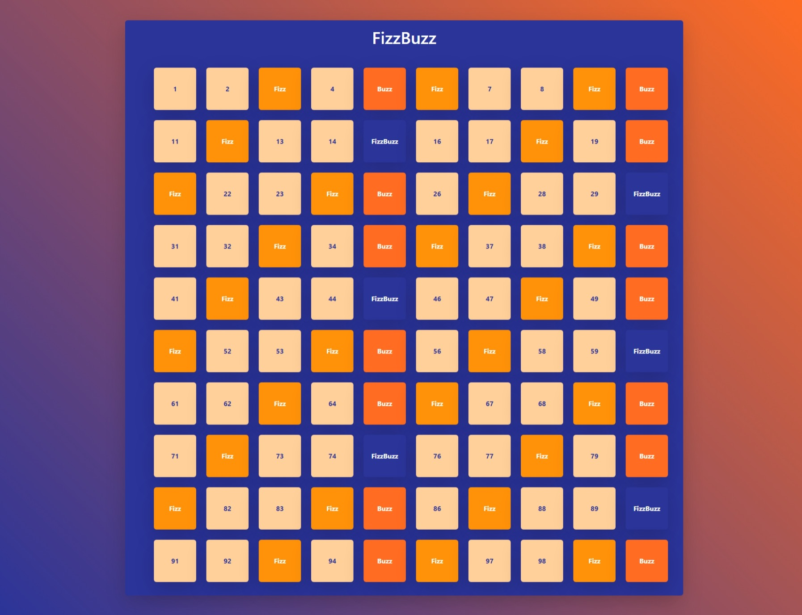

# FizzBuzz



_HTML+css(bootstrap)+js_

Scrivi un programma che stampi in console i numeri da 1 a 100, ma che per i multipli di 3 stampi “Fizz” al posto del numero e per i multipli di 5 stampi “Buzz”. Per i numeri che sono sia multipli di 3 che di 5 stampi “FizzBuzz”.

## Indice

- [Scomposizone del problema](#scomposizione-del-problema)
- [Soluzione](#soluzione)

### Scomposizione del problema

1. Creazione di un ciclo for con contatore fino a 100
2. Stampa dei numeri con `console.log`
3. Creazione di condizioni `if/else if` per le tre casistiche
   - multipli di 3 (numero che diviso per 3 dia resto zero) - stampare 'Fizz'
   - multipli di 5 (numero che diviso per 5 dia resto 0) - stampare 'Buzz?
   - multipli di 5 e 3 (numero che diviso per 3 e diviso per 5 dia resto zero) - stampare 'FizzBuzz'

NB

usare l' operatore modulo per determinare il resto

cercare di unire le stringhe 'Fizz' e 'Buzz' per stampare 'FizzBuzz'

4. Creazione di un container nel DOM in cui mostrare la lista
   - creo un container nell' HTML
   - creo un `ul`
   - inserisco nell' `ul` la lista dei numeri

NB
usare `document.createElement('li');` per creare i `li` da inserire nell' `ul`

usare `append` per avere un output nell' HTML

### Scomposizione del problema

**_Creazione di un ciclo for con contatore fino a 100_**

```js
for (let i = 1; i <= 100; i++) {}
```

- inizializzo la variabile contatore `i` e le assegno valore uno
- imposto la condizione che `i` sia minore uguale di 100 (il ciclo continuerà finche la condizione non sarà verificata)
- aumento il valore di `i` di uno (`i++` equivale a i = i + 1)

**_Stampa dei numeri con `console.log`_**

```js
for (let i = 1; i <= 100; i++) {
  console.log({ i });
}
```

- stampo in console i valori di i, avrò come output una lista che va da 1 a 100

**_Creazione di condizioni `if/else if` per le tre casistiche_**

```js
const divisibilePerTre = "Fizz";
const divisibilePerCinque = "Buzz";

for (let i = 1; i <= 100; i++) {
  if (i % 3 === 0 && i % 5 === 0) {
    console.log(divisibilePerTre + divisibilePerCinque);
  } else if (i % 5 === 0) {
    console.log(divisibilePerCinque);
  } else if (i % 3 === 0) {
    console.log(divisibilePerTre);
  } else {
    console.log({ i });
  }
}
```

- creo due variabili che identificano se un numero sia divisibile per 3 o 5 (così da poterne cambiare il valore in futuro se neseccario)
- usando l' operatore modulo (`%`) creo le tre casistiche
- cerco prima quelli sia divisibili per 5 che per 3 (perchè soddisfano anche le condizioni successive) e stampo "FizzBuzz"
- cerco i numeri divisibiuli per 5 e stampo "Buzz"
- cerco i numeri divisibiuli per 3 e stampo "Fizz"
- se il numero non soddisfa nessuna delle condizioni stampo il numero stesso (NB se messo fuori da else crea contrasto con i numeri che soddisfano le condizioni)

**_Creazione di un container nel DOM in cui mostrare la lista_**

```html
<body class="p-5 text-white fw-bold">
  <!-- *container lista -->
  <div class="container p-3 rounded shadow-lg">
    <h1 class="text-center mb-5">FizzBuzz</h1>
    <!-- *lista -->
    <ul class="-lc-list row justify-content-center gap-4"></ul>
    <!-- *lista -->
  </div>
  <!-- *container lista -->
</body>
```

- creo una `ul` in cui andrò a inserire i numeri

```js
const elementLista = document.querySelector(".-lc-list");

for (let i = 1; i <= 100; i++) {
  //* creazione elemento html li
  const li = document.createElement("li");
  li.classList.add("-lc-list-item");
  li.classList.add("rounded");
  li.classList.add("shadow-lg");

  //! condizioni
  if (i % 3 === 0 && i % 5 === 0) {
    console.log(divisibilePerTre + divisibilePerCinque);
    li.append(divisibilePerTre + divisibilePerCinque);
    li.classList.add("-lc-number-3-5");
  } else if (i % 5 === 0) {
    console.log(divisibilePerCinque);
    li.append(divisibilePerCinque);
    li.classList.add("-lc-number-5");
  } else if (i % 3 === 0) {
    console.log(divisibilePerTre);
    li.append(divisibilePerTre);
    li.classList.add("-lc-number-3");
  } else {
    console.log({ i });
    li.append(i);
    li.classList.add("-lc-number");
  }

  //* inserirsco li nella ul
  elementLista.append(li);
}
```

- creo la variabile `elementLista` che avrà come valore `ul` nel mio html
- creo e assegno a una variabile l' elemento html li, usando `const li = document.createElement("li");`
- assegno al mio elementi `li` delle classi (personali e bootsrap), usando `li.classList.add("nome-classe");`
- inserisco all' interno dei `li` (a seconda delle condizioni) il suo contenuto html, usando `li.append(divisibilePerCinque);`
- alla fine, fuori dalle condizioni, inserisco il `li` creato all' interno di `ul` (`  elementLista.append(li);`)
- ripeto il ciclo

NB

alcune classi sono state assegnate prima dell' `if` perchè comuni, altre invece sono relative e specifiche ad alcune condizioni dell' `if`

`li.append(contenuto);` è simile a `.innerHTML` ma al contrario di quest' ultimo funziona con `document.createElement`
